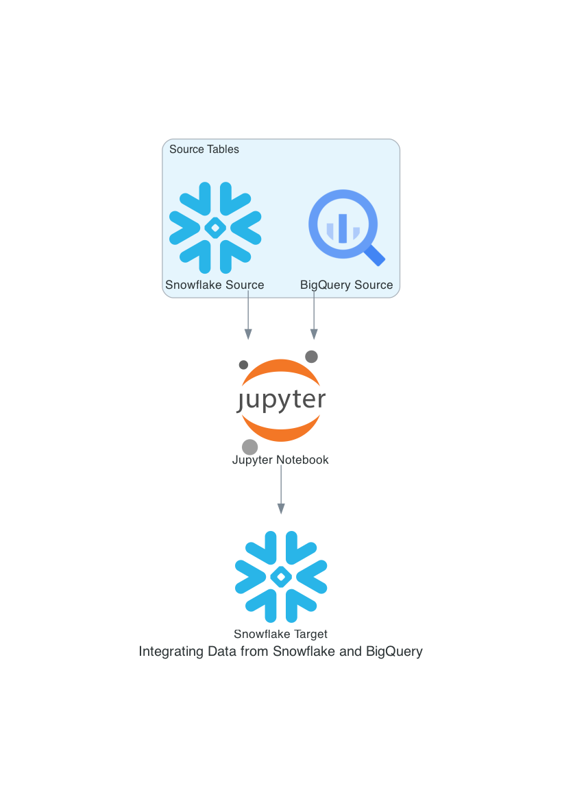

# Query Tool

## User Story: Leveraging Data to Optimize Digital Marketing and Personalization

### Background

A retail company in the e-commerce space wants to evaluate the effectiveness of its digital marketing campaigns and better understand its customers' shopping behaviors. This requires analyzing vast amounts of data from multiple sources:

- **Snowflake Database (Product and Order Data):** Snowflake holds detailed data about products, orders, and customer transactions.
- **Google Analytics (GA) via BigQuery (Event Data):** BigQuery captures events like product views, clicks, and interactions that happen on the website.

To achieve this, the company needs to:

- Extract order and product data from Snowflake.
- Retrieve user interaction data, like product views and clicks, from BigQuery.
- Combine these datasets to gain a holistic view of the customer's journey from first interaction to final purchase.

### Objectives

The company has several key objectives:

- **Evaluate Marketing Performance:** By linking product views and clicks (from BigQuery) with actual order data (from Snowflake), the business can determine how well their marketing efforts are driving actual purchases.
- **Personalization of Offers:** Understanding which products are most viewed but not purchased can help marketers deliver targeted promotions and offers. Additionally, this analysis can inform product recommendations to individual customers.
- **Customer Behavior Insights:** By joining the interaction data (views, clicks) with order information, the company can identify patterns in customer behavior — such as whether certain product categories are consistently viewed but not purchased, or if some products are purchased more frequently after being viewed in ads or on social media.

### Process

#### Data Extraction

- **Snowflake:** Stores detailed data on orders, including product IDs, customer IDs, total amount, and other transactional details. This data is extracted via SQL queries using the `query_snowflake` method, which retrieves the necessary order and product information.
- **BigQuery:** Captures real-time user interactions with the website, including product views and clicks, which are stored in event tables. These events are retrieved via SQL queries using the `query_bigquery` method.

#### Data Joining

Once the data is extracted from both sources, the next step is to join the datasets. The `join_results` function is used to merge the product and order data (from Snowflake) with the user interaction data (from BigQuery). This join is typically performed on a common field, such as `Order_ID`, which links orders with the user behavior events related to those products.

This process enables the business to combine data on customer purchases with the digital interactions they had with products before purchasing. For example, it can link a user’s click on a product ad in Google Analytics (via BigQuery) with the eventual purchase of that product in the Snowflake database.

#### Data Analysis and Reporting

After the data is joined, the company can perform various analyses:

- **Conversion Rate Analysis:** The company can evaluate how often products that were viewed or clicked are eventually purchased, which is a critical indicator of digital marketing success.
- **Product Performance:** Identifying which products are frequently viewed but not purchased can help optimize product listings and highlight items for special promotions.
- **Customer Behavior Patterns:** By analyzing the patterns in the data, such as products viewed multiple times but never bought, the company can refine its targeting strategies (e.g., retargeting ads, personalized email campaigns).

#### Data Logging and Audit Trail

All the steps involved in querying the databases, joining the data, and processing it are logged. These logs capture essential information such as the number of rows returned, time taken for each query, the size of the data transferred, the cost associated with the queries, and any duplicated rows or columns. This logging is crucial for maintaining data integrity and transparency, as well as for tracking the performance of the database queries.

The logs are stored in pandas DataFrames, which are updated with each operation, providing a detailed audit trail that allows for troubleshooting, performance analysis, and cost tracking of the queries executed.

#### Data Export and Further Utilization

The final joined dataset can be exported for further analysis or reporting. If necessary, the results can be written back into the Snowflake database for storage, or the data can be saved into CSV files for additional processing or reporting.

## Repository structure
SQL queries should be located in `sql` directory. Python code is located in directory `src`, explaratory work in `notebooks` folder. 

## How to run it?
In order to run this locally, you need to have
1. Environmental variables set up
2. Virtual environment activated

### Environmental variables
Navigate to root folder. First, copy `.env.example` file and name it as `.env`. In this new file, set up variable values - feel free to reach to project authors for details. 

### Virtual Environment
The project uses [Poetry](https://python-poetry.org/) for dependency management. Once you have [Poetry](https://python-poetry.org/) installed, run `poetry install` in the root directory of the project. It will create a virtual environment and install all the dependencies. To access the virtual environment, run `poetry shell` in the directory.

Add `export PATH="$HOME/.local/bin:$PATH"` to the terminal to locate poetry if needed.

#### Linters and Code Formatters
In project, we use [black](https://github.com/psf/black) and [flake8](https://flake8.pycqa.org/en/latest/). Both have corresponding configuration inside `pyproject.toml` file.

##### Run Black (Code formatter):

`black .`

##### Run Flake8 (Code formatter):

`flake8 --config pyproject.toml`

## How to contribute
1. Create a new git branch with the most accurate name, prefixed by Jira task ID.
2. Create a PR - at least one approval is needed. 
